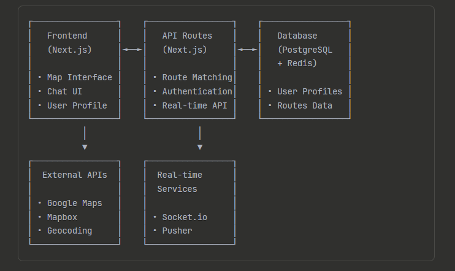

# Project README

## Table of Contents
1. [Why Next.js for This Project](#why-nextjs-for-this-project)
2. [Project Architecture Overview](#project-architecture-overview)
3. [Technology Stack](#technology-stack)
4. [Core Features Implementation](#core-features-implementation)
5. [Database Design](#database-design)
6. [API Design](#api-design)
7. [Security & Privacy](#security--privacy)
8. [Deployment Strategy](#deployment-strategy)

---

## Why Next.js for This Project
Next.js is ideal for this project because it offers a full-stack solution, letting us build both frontend and backend APIs in one codebase. Its SSR and SSG support ensure fast load times and better SEO for dynamic map data, while built-in API routes simplify backend development. It scales easily with platforms like Vercel, delivers strong performance optimizations, and has a mature ecosystem for seamless integrations.

## Project Architecture Overview
The project follows a modular architecture with clear separation of concerns. Frontend pages, API routes, and database models are organized for maintainability and scalability.
	
## Technology Stack
| Technology            | Alternatives                | Why This One?                                                      |
|-----------------------|-----------------------------|--------------------------------------------------------------------|
| Next.js 14+           | React, Vue, Angular         | SSR/SSG, App Router, best Next.js support, developer experience    |
| Mapbox GL JS          | Google Maps, Leaflet        | High customization, open-source, better pricing, large dataset support |
| PostgreSQL            | MongoDB, MySQL              | ACID compliance, spatial queries (PostGIS), relational integrity    |
| Redis                 | Memcached, in-memory cache  | Fast session management, real-time chat caching                     |
| NextAuth.js           | Firebase Auth, Auth0        | Next.js integration, custom student verification, privacy control   |
| Socket.io             | Pusher, WebRTC              | Self-hosted, privacy, cost-effective, simple chat implementation    |
| Zustand + SWR         | Redux, Context, React Query | Simple setup, TypeScript support, API caching, live data revalidation |
| Tailwind CSS          | Styled Components, MUI      | Compile-time performance, fast dev, customizable, small bundle      |
| React Hook Form + Zod | Formik, Yup                 | Fast, small bundle, runtime validation matches TypeScript types     |
| TypeScript            | JavaScript                  | Location data accuracy, developer experience, reduced runtime errors|
## Core Features Implementation

### 1. Map Interface

**Components Structure:**
```
/components
	/map
		- InteractiveMap.tsx        // Main map component
		- RouteOverlay.tsx          // Route visualization
		- StudentMarkers.tsx        // Other student locations
		- LocationInput.tsx         // Home/destination input
```

**Implementation Approach:**
- Google Places Autocomplete for location input
- Mapbox GL JS for route visualization
- Custom markers for student locations
- Real-time updates via WebSocket

### 2. Route Matching Algorithm

**Algorithm in API Route:**
```
/api/routes
	- match.ts                   // Main matching logic
	- calculate-overlap.ts       // Route similarity calculation
	- nearby-students.ts         // Geographic proximity
```

**Matching Strategy:**
- Geographic Proximity: Users within 2km radius
- Route Overlap: Calculate percentage of shared path
- Time Compatibility: Departure time within 30-minute window
- Preferences: Gender, smoking, music preferences

### 3. Real-Time Chat System

**Components:**
```
/components/chat
	- ChatWindow.tsx
	- MessageBubble.tsx
	- UserList.tsx

/api/socket
	- chat-handler.ts
	- room-management.ts
```

### 4. Privacy & Username System

- Unique Username Generation: Adjective + Noun + Number pattern
- No Duplicate Prevention: Hash-based checking
- Identity Protection: Real names never exposed in chat
- Gradual Disclosure: Users choose what to share after initial contact

## Database Design

The database schema is designed for scalability and data integrity. Below are the main tables:

### User Schema
```sql
CREATE TABLE users (
	id UUID PRIMARY KEY DEFAULT gen_random_uuid(),
	email VARCHAR(255) UNIQUE NOT NULL,
	username VARCHAR(50) UNIQUE NOT NULL,
	student_id VARCHAR(100),
	university VARCHAR(255),
	phone VARCHAR(20),
	profile_picture TEXT,
	preferences JSONB,
	created_at TIMESTAMP DEFAULT NOW(),
	updated_at TIMESTAMP DEFAULT NOW()
);
```

### Routes Schema
```sql
CREATE TABLE routes (
	id UUID PRIMARY KEY DEFAULT gen_random_uuid(),
	user_id UUID REFERENCES users(id),
	origin_lat DECIMAL(10, 8),
	origin_lng DECIMAL(11, 8),
	destination_lat DECIMAL(10, 8),
	destination_lng DECIMAL(11, 8),
	origin_address TEXT,
	destination_address TEXT,
	departure_time TIME,
	route_polyline TEXT,
	active BOOLEAN DEFAULT true,
	created_at TIMESTAMP DEFAULT NOW()
);
```

### Matches Schema
```sql
CREATE TABLE route_matches (
	id UUID PRIMARY KEY DEFAULT gen_random_uuid(),
	user1_id UUID REFERENCES users(id),
	user2_id UUID REFERENCES users(id),
	route1_id UUID REFERENCES routes(id),
	route2_id UUID REFERENCES routes(id),
	overlap_percentage DECIMAL(5,2),
	status VARCHAR(20) DEFAULT 'pending', -- pending, accepted, rejected
	created_at TIMESTAMP DEFAULT NOW()
);
```

### Chat Schema
```sql
CREATE TABLE chat_rooms (
	id UUID PRIMARY KEY DEFAULT gen_random_uuid(),
	match_id UUID REFERENCES route_matches(id),
	created_at TIMESTAMP DEFAULT NOW()
);

CREATE TABLE messages (
	id UUID PRIMARY KEY DEFAULT gen_random_uuid(),
	room_id UUID REFERENCES chat_rooms(id),
	sender_id UUID REFERENCES users(id),
	message TEXT NOT NULL,
	created_at TIMESTAMP DEFAULT NOW()
);
```

## API Design

Below are the main API endpoints for the application:

### Authentication Endpoints
```typescript
POST   /api/auth/register
POST   /api/auth/login
POST   /api/auth/logout
GET    /api/auth/session
POST   /api/auth/verify-student
```

### Route Management
```typescript
POST   /api/routes/create
GET    /api/routes/user/:userId
PUT    /api/routes/:routeId
DELETE /api/routes/:routeId
POST   /api/routes/find-matches
```

### Matching System
```typescript
GET    /api/matches/user/:userId
POST   /api/matches/accept/:matchId
POST   /api/matches/reject/:matchId
GET    /api/matches/nearby
```

### Chat System
```typescript
GET    /api/chat/rooms/:userId
POST   /api/chat/send
GET    /api/chat/history/:roomId
WebSocket: /api/socket/chat
```

## Security & Privacy

### Privacy Protection

- **Anonymous Identity:** Generated usernames + gradual information disclosure
- **Location Privacy:** Hidden exact addresses, encrypted communication
- **User Control:** Students choose what personal data to share

### Security Implementation

- **Data Protection:** Input validation (Zod), SQL injection prevention (Prisma)
- **Attack Prevention:** Rate limiting, CSRF/XSS protection, CSP headers
- **Student Verification:** University email + optional ID upload


## Deployment Strategy
## Performance Optimization

- **Image Optimization:** Next.js built-in optimization
- **Code Splitting:** Automatic route-based splitting
- **Caching:** Redis for sessions, SWR for API calls
- **CDN:** Vercel's global edge network
- **Database Optimization:** Proper indexing for spatial queries

## Monitoring & Analytics

- **Error Tracking:** Sentry
- **Performance:** Vercel Analytics
- **User Analytics:** Posthog (privacy-focused)
- **Database Monitoring:** Built-in database metrics

### Platform Choice: Vercel

**Why Vercel over alternatives:**

- **vs AWS:** Simpler setup, better Next.js optimization
- **vs Netlify:** Better backend support, edge functions
- **vs Railway:** More mature platform, better scaling

Automated build and deployment pipelines ensure reliability and scalability.
